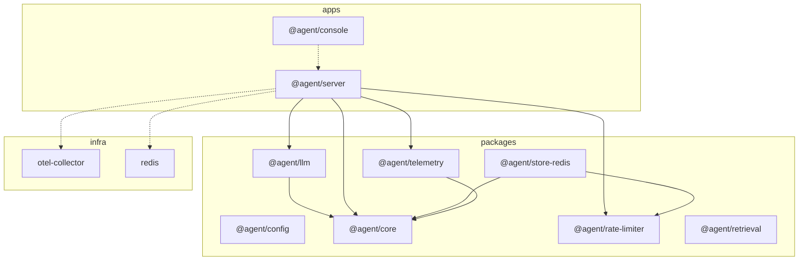

# Architecture

The kit is a directed acyclic graph. `workspace:*` edges are solid. HTTP, Redis, and the collector are dashed runtime edges. Packages may depend only on other packages. Apps depend on packages. Infra has no outbound edges.

`@agent/config` loads this graph from the workspace package.json files, then overlays the three runtime edges. `topoSort` is Kahn with an alphabetical ready queue. A three-color DFS reports a cycle as a closed path. Compose vs Helm: [runbook.md](./runbook.md). Why one repo: [why-a-monorepo.md](./why-a-monorepo.md).
